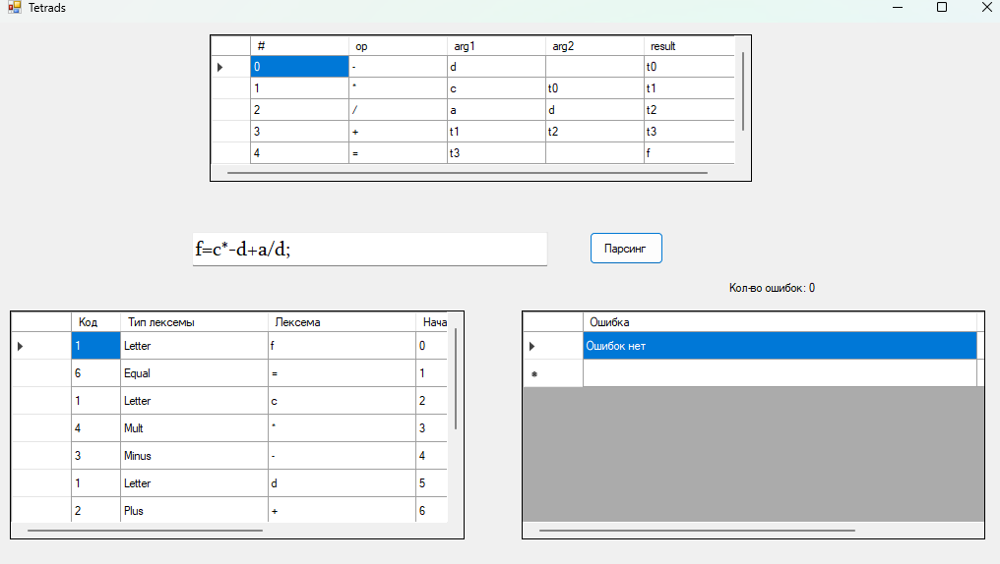
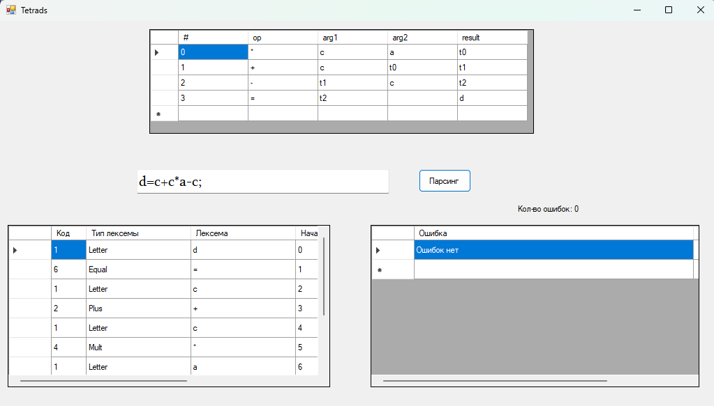
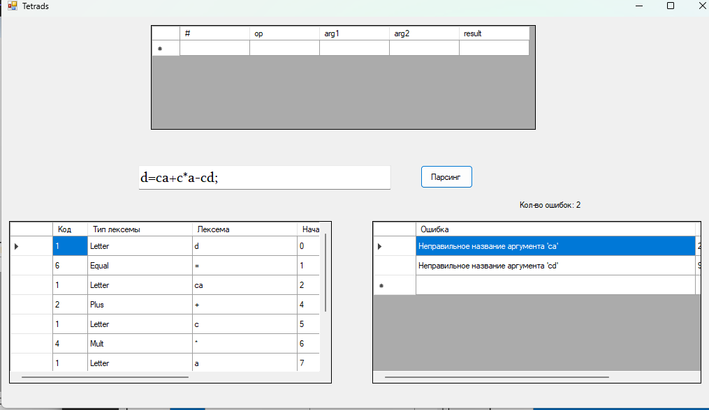
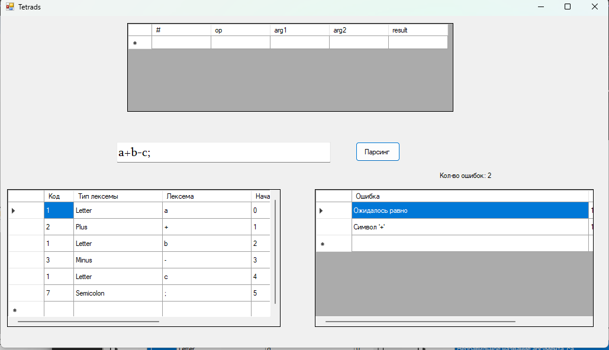

# Лабораторная работа №5
# Включение семантики в анализатор. Создание внутренней формы представления программы.

## В качестве внутренней формы представления программы выберем Многоадресный код с явно именуемым результатом (тетрады)

## Цель работы: Дополнить анализатор, разработанный в рамках лабораторных работ, этапом формирования внутренней формы представления программы.

## Задание: 2 вариант. В качестве внутренней формы представления программы выберем тетрады. Тетрада имеет четыре поля: op, arg1, arg2 и result.

## Задание:

### 1) Дополнить парсер грамматикой G[<АВ>]. Реализовать данную КС-граммматику методом рекурсивного спуска:

1. E → TA 

2. A → ε | + TA | - TA 

3. T → ОВ 

4. В → ε | *ОВ | /ОВ 

5. О → id | (E) 

### 2) Реализовать алгоритм записи выражений в форме тетрад.

## Примеры верных строк
a=b-d*c;

f=c*-d+a/d;

d=c+c*a-c;

## Тестовые примеры

